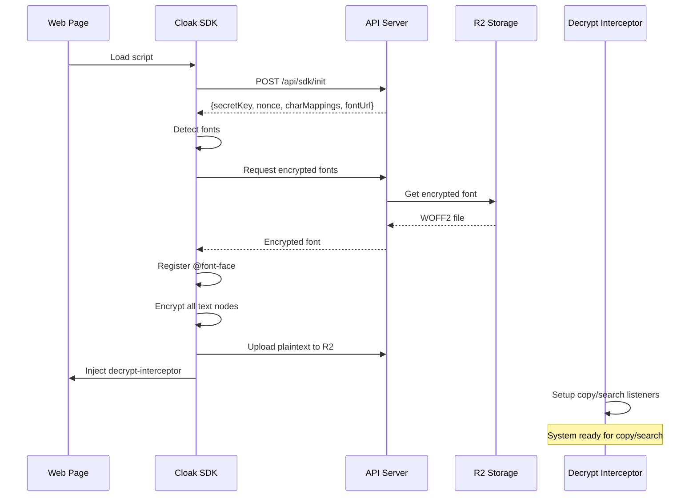

# Phase 2: Architecture Documentation and Verification - Research

**Researched:** 2026-01-23
**Domain:** Technical documentation for complex encryption systems, algorithm verification
**Confidence:** HIGH

## Summary

This phase focuses on creating comprehensive documentation of the Cloak SDK encryption/decryption architecture to systematically identify root causes of rendering issues rather than applying brute-force fixes. The research identifies proven methodologies for documenting complex system flows, comparing two implementations for consistency, and performing root cause analysis.

Key findings:
- **C4 Model** is the current standard for software architecture documentation (2026), providing hierarchical views from context to code level
- **Comparison tables and flow diagrams** work better than prose for algorithm verification
- **Line-by-line structural comparison** is essential for detecting subtle implementation differences that cause bugs
- **Decision trees and symptom-cause mapping** enable systematic troubleshooting instead of ad-hoc debugging
- **Position mapping verification** is the critical verification point for this system - SDK and decrypt-interceptor must use identical algorithms

**Primary recommendation:** Use comparison tables for algorithm verification, sequence diagrams for flow documentation, and decision trees for troubleshooting guides. Focus verification on position mapping algorithms, block boundary detection, exclusion logic, and text-transform handling.

## Standard Stack

### Core Documentation Tools/Methodologies

| Methodology | Version/Year | Purpose | Why Standard |
|-------------|--------------|---------|--------------|
| C4 Model | 2026 | Architecture visualization (Context, Containers, Components, Code) | Industry standard for hierarchical system documentation, simple and practical |
| UML Sequence Diagrams | Current | Document temporal flows and message passing between components | Best for showing step-by-step interactions (init → encrypt → upload → decrypt) |
| State Machine Diagrams | Current | Document behavior changes based on events | Ideal for encryption states (unencrypted → encrypting → encrypted → decrypting) |
| Comparison Tables | 2026 | Algorithm verification and consistency checking | Most effective format for side-by-side algorithm comparison |
| Decision Trees | 2026 | Troubleshooting and root cause analysis | Systematic approach to debugging from symptoms to causes |
| Mermaid.js | Current | Diagram-as-code in Markdown | Keeps diagrams version-controlled with documentation |

### Supporting Tools

| Tool | Purpose | When to Use |
|------|---------|-------------|
| Code diff tools | Structural comparison | Comparing SDK vs decrypt-interceptor implementations |
| Regression analysis | Identify divergence points | Finding where position mapping algorithms differ |
| Formal verification methods | Prove algorithm equivalence | Critical path verification (optional, advanced) |

### Alternatives Considered

| Instead of | Could Use | Tradeoff |
|------------|-----------|----------|
| C4 Model | Arc42 | Arc42 more comprehensive but heavier; C4 better for getting started |
| Sequence diagrams | Activity diagrams | Activity diagrams better for workflows, sequence better for message flows |
| Comparison tables | Prose descriptions | Tables force explicit comparison, prose allows more ambiguity |

**Installation:**
```bash
# For Mermaid.js diagrams in Markdown
npm install -g @mermaid-js/mermaid-cli  # Optional: for rendering
# Mermaid renders in GitHub/many Markdown viewers without installation
```

## Architecture Patterns

### Recommended Documentation Structure

```
.planning/
├── phases/
│   └── 02-architecture-documentation-and-verification-document-complet/
│       ├── 02-RESEARCH.md                    # This file
│       ├── 02-PLAN.md                         # Task breakdown
│       ├── flows/
│       │   ├── complete-flow.md               # End-to-end sequence diagram
│       │   ├── encryption-flow.md             # SDK encryption details
│       │   ├── position-mapping-flow.md       # Critical path
│       │   └── decryption-flow.md             # decrypt-interceptor details
│       ├── verification/
│       │   ├── position-mapping-comparison.md # Line-by-line algorithm comparison
│       │   ├── exclusion-logic-comparison.md  # Verify consistency
│       │   ├── block-detection-comparison.md  # Verify BLOCK_ELEMENTS arrays
│       │   └── text-transform-verification.md # Check handling consistency
│       └── troubleshooting/
│           ├── rendering-issues-decision-tree.md
│           ├── position-mismatch-guide.md
│           └── common-pitfalls.md
```

### Pattern 1: Comparison Table for Algorithm Verification

**What:** Side-by-side comparison of implementation details to verify consistency

**When to use:** When two implementations must be identical (SDK position mapping vs decrypt-interceptor position mapping)

**Example:**
```markdown
## Position Mapping Algorithm Comparison

| Step | SDK (cloak-sdk.js) | decrypt-interceptor (position.js) | Match? |
|------|-------------------|-----------------------------------|--------|
| 1. Tree traversal | `TreeWalker(document.body, SHOW_TEXT)` | `TreeWalker(document.body, SHOW_TEXT)` | ✅ |
| 2. Exclusion check | `shouldExcludeNode(textNode)` | `shouldExcludeTextNode(textNode)` | ⚠️ Name differs |
| 3. Zero-width strip | `text.replace(/\u200B/g, '')` | `text.replace(/\u200B/g, '')` | ✅ |
| 4. Empty check | `!cleanText.trim()` | `!text.trim()` | ✅ |
| 5. Block boundary | `if (lastBlock !== null && currentBlock !== null && currentBlock !== lastBlock)` | `if (lastBlock !== null && currentBlock !== null && currentBlock !== lastBlock)` | ✅ |
| 6. Position increment | `totalCharacters += 1` (newline) | `globalCharIndex += 1` (newline) | ✅ Logic |
| 7. Text addition | `totalCharacters += transformedCleanText.length` | `globalCharIndex += text.length` | ⚠️ Transformed vs raw |

**Issues Found:** Text-transform handling may differ - SDK uses transformed text length, need to verify decrypt-interceptor does too.
```
Source: Derived from code analysis

### Pattern 2: Sequence Diagram for Flow Documentation

**What:** Temporal documentation showing step-by-step message passing

**When to use:** Documenting initialization, encryption flow, decrypt flow

**Example:**

Source: [C4 Model](https://c4model.com/), [GeeksforGeeks UML Sequence Diagrams](https://www.geeksforgeeks.org/system-design/unified-modeling-language-uml-sequence-diagrams/)

### Pattern 3: Decision Tree for Troubleshooting

**What:** Structured symptom-to-cause-to-solution mapping

**When to use:** Creating troubleshooting guides for common issues

**Example:**
```markdown
## Text Rendering Issues Decision Tree

**Symptom:** Text appears as gibberish

├─ **Check 1:** Is the text encrypted?
│  └─ YES → Check 2
│  └─ NO → Text should be plaintext, check if SDK ran
│
├─ **Check 2:** Are encrypted fonts loaded?
│  └─ YES → Check 3
│  └─ NO → **Root cause:** Fonts failed to load
│     └─ **Fix:** Check network tab, verify font URLs, check CORS
│
├─ **Check 3:** Are encrypted fonts applied to this element?
│  └─ YES → Check 4
│  └─ NO → **Root cause:** Font application skipped this element
│     └─ **Fix:** Check exclusion logic, verify element not in skip list
│
└─ **Check 4:** Does element have !important CSS overriding fonts?
   └─ YES → **Root cause:** CSS specificity issue
      └─ **Fix:** Remove !important or increase encrypted font specificity
```
Source: [AssurX Decision Trees for RCA](https://www.assurx.com/how-to-use-decision-trees-for-rca/)

### Anti-Patterns to Avoid

- **Prose instead of tables:** Don't write "The SDK and decrypt-interceptor should use the same exclusion logic" - create a comparison table showing they DO
- **Assuming code matches without verification:** Don't trust that two functions with similar names do the same thing - verify line-by-line
- **Documentation without verification:** Don't document how the system "should" work - document how it ACTUALLY works through code analysis
- **Generic troubleshooting:** Don't write "check the logs" - create specific decision trees with actual symptoms from real issues

## Don't Hand-Roll

Problems that look simple but have existing solutions:

| Problem | Don't Build | Use Instead | Why |
|---------|-------------|-------------|-----|
| Diagram rendering | Custom SVG generator | Mermaid.js in Markdown | Mermaid is version-controllable, widely supported, renders in GitHub |
| Code comparison | Manual side-by-side | Structural diff tools | Automated tools catch subtle differences humans miss |
| Flow visualization | PowerPoint diagrams | UML sequence diagrams | UML is standardized, tools support it, developers understand it |
| Root cause documentation | Ad-hoc text docs | Decision tree format | Decision trees force systematic thinking, easy to follow |

**Key insight:** Documentation quality comes from **structure and verification**, not custom tooling. Use standard formats (Markdown, Mermaid, UML) that integrate with version control and are widely understood.

## Common Pitfalls

### Pitfall 1: Assuming Similar Code is Identical

**What goes wrong:** Two functions named similarly (e.g., `getContainingBlock` in SDK vs `getContainingBlockSkippingHighlights` in decrypt-interceptor) are assumed to be identical, but subtle differences cause position mismatches.

**Why it happens:** Code was copied and modified over time, or different contributors implemented similar logic independently.

**How to avoid:**
1. Create comparison tables for ALL critical algorithms
2. Use structural diff tools to identify differences
3. Document EVERY difference with confidence level (intentional vs potential bug)

**Warning signs:**
- Copy/paste failures where positions are off by a few characters
- Search highlights appearing in wrong locations
- Intermittent issues that vary by page structure

### Pitfall 2: Documenting Intent Instead of Reality

**What goes wrong:** Documentation describes how the system "should" work based on design intent, but actual implementation has edge cases or bugs not captured.

**Why it happens:** Documentation written before implementation, or updated based on memory instead of code inspection.

**How to avoid:**
1. Document from code, not from memory
2. Include "verification" sections that prove documented behavior matches code
3. Mark assumptions with confidence levels (HIGH/MEDIUM/LOW)

**Warning signs:**
- Documentation says "X happens" but code shows conditional logic
- Edge cases discovered in production that aren't documented
- Developers don't trust documentation and read code instead

### Pitfall 3: Incomplete Algorithm Comparison

**What goes wrong:** Only comparing "happy path" logic, missing edge cases like:
- Zero-width space handling
- Trailing whitespace trimming
- Block boundary detection
- Empty text node skipping

**Why it happens:** Focus on main algorithm, overlook preprocessing/postprocessing steps.

**How to avoid:**
1. Compare ENTIRE function, not just core logic
2. Create checklist of common edge cases (empty strings, whitespace, special chars, nulls)
3. Test with pathological inputs (all spaces, all zero-width chars, deeply nested blocks)

**Warning signs:**
- Position mapping works on simple pages but fails on complex layouts
- Issues only appear with certain HTML structures
- Character counts differ between SDK and decrypt-interceptor

### Pitfall 4: Over-Abstracting Troubleshooting Guides

**What goes wrong:** Troubleshooting guide says "check if fonts are loaded" without explaining HOW to check or what to look for.

**Why it happens:** Writer assumes reader has same knowledge level.

**How to avoid:**
1. Provide specific commands/tools (e.g., "Open DevTools → Network tab → filter by .woff2")
2. Include expected vs actual outputs
3. Link to specific code lines for each check

**Warning signs:**
- Developers ask "how do I check that?" when following guide
- Troubleshooting guide doesn't reduce debugging time
- Same questions asked repeatedly despite guide existing

### Pitfall 5: Ignoring Text-Transform Edge Cases

**What goes wrong:** SDK transforms text before encryption (e.g., "hello" → "HELLO" → encrypted), but decrypt-interceptor doesn't account for this in position mapping, causing mismatches.

**Why it happens:** Text-transform is a CSS presentation layer feature that affects character length and position calculations, easy to overlook.

**How to avoid:**
1. Explicitly document text-transform handling in both SDK and decrypt-interceptor
2. Verify position calculations use transformed length, not original
3. Test with uppercase, lowercase, capitalize, and full-width variants

**Warning signs:**
- Copy/paste issues only on uppercased/lowercased elements
- Search highlights misaligned on elements with text-transform CSS
- Position offsets correlate with capitalization differences

## Code Examples

Verified patterns from official sources and project code:

### Comparison Table Template (Verification Documentation)

```markdown
## [Algorithm Name] Comparison

| Step | File 1 (source.js:line) | File 2 (target.js:line) | Status | Notes |
|------|------------------------|------------------------|--------|-------|
| Setup | `const walker = TreeWalker(...)` | `const walker = TreeWalker(...)` | ✅ Match | Both use same NodeFilter |
| Loop | `while (node = walker.nextNode())` | `while (textNode = walker.nextNode())` | ✅ Match | Variable name differs only |
| Check | `shouldExcludeNode(node)` | `shouldExcludeTextNode(textNode)` | ⚠️ Verify | Function names differ, need to compare internals |

**Verification Status:** INCOMPLETE - step 3 needs function comparison
**Confidence:** MEDIUM until shouldExcludeNode vs shouldExcludeTextNode verified
```

### Sequence Diagram Template (Flow Documentation)

```markdown
## Encryption Flow

\`\`\`mermaid
sequenceDiagram
    participant SDK
    participant DOM
    participant PlaintextIndex

    SDK->>DOM: getTextNodes()
    DOM-->>SDK: [textNode1, textNode2, ...]
    loop For each text node
        SDK->>SDK: shouldExcludeNode()?
        alt Excluded
            SDK->>SDK: Skip
        else Not excluded
            SDK->>SDK: encryptText(node.textContent)
            SDK->>PlaintextIndex: Store {start, end, original}
            SDK->>DOM: node.textContent = encrypted
        end
    end
\`\`\`

**Critical Points:**
- Line X: Exclusion check MUST match decrypt-interceptor
- Line Y: Position tracking MUST account for block boundaries
```

### Decision Tree Template (Troubleshooting Guide)

```markdown
## [Issue Type] Troubleshooting

**Initial Symptom:** [User-visible problem]

### Step 1: Verify [First Check]
**How to check:** [Specific instructions with commands/tools]
**Expected:** [What you should see]
**Actual:** [What to record]

- If [condition A] → Root cause: [X] → See section [link]
- If [condition B] → Proceed to Step 2

### Step 2: Verify [Second Check]
[Continue pattern...]

### Known Root Causes

#### Root Cause 1: [Name]
**Symptoms:** [List of observable symptoms]
**Verification:** [How to confirm this is the cause]
**Fix:** [Specific steps to resolve]
**Code locations:**
- cloak-sdk.js:LINE - [what to check]
- decrypt-interceptor.js:LINE - [what to check]
```

### Position Mapping Verification Code (from decrypt/src/position.js)

```javascript
// Source: client/decrypt/src/position.js:417-505
function buildTextPositionMap() {
    const positionMap = [];
    let globalCharIndex = 0;
    let fullEncryptedText = '';
    let lastBlock = null;

    // CRITICAL: Walk ALL text nodes in document order (same order as SDK)
    const walker = document.createTreeWalker(
        document.body,
        NodeFilter.SHOW_TEXT,
        null
    );

    let textNode;
    while (textNode = walker.nextNode()) {
        // MUST MATCH SDK: Same exclusion logic
        if (shouldExcludeTextNodeForPositionCalc(textNode)) {
            continue;
        }

        let text = textNode.textContent;

        // MUST MATCH SDK: Strip zero-width spaces
        text = text.replace(/\u200B/g, '');

        // MUST MATCH SDK: Skip empty/whitespace-only
        if (text.length === 0 || !text.trim()) {
            continue;
        }

        // MUST MATCH SDK: Block boundary detection
        const currentBlock = getContainingBlockSkippingHighlights(textNode);
        if (lastBlock !== null && currentBlock !== null && currentBlock !== lastBlock) {
            globalCharIndex += 1;  // Count the \n marker
            fullEncryptedText += '\n';
        }
        if (currentBlock !== null) {
            lastBlock = currentBlock;
        }

        // Store position mapping
        positionMap.push({
            node: textNode,
            parent: textNode.parentElement,
            startIndex: globalCharIndex,
            endIndex: globalCharIndex + text.length,
            length: text.length
        });

        globalCharIndex += text.length;
        fullEncryptedText += text;
    }

    // MUST MATCH SDK: Strip trailing whitespace
    fullEncryptedText = fullEncryptedText.replace(/\s+$/, '');

    return { positionMap, totalLength: fullEncryptedText.length };
}
```

**Key Verification Points:**
1. Line 424-428: TreeWalker setup - must match SDK
2. Line 437: Exclusion function name differs - VERIFY internals match
3. Line 444: Zero-width space stripping - matches SDK
4. Line 447-449: Empty check - matches SDK
5. Line 460: Block detection function name differs - VERIFY internals match
6. Line 461-463: Block boundary logic - matches SDK
7. Line 485: Trailing whitespace - matches SDK `.rstrip()`

## State of the Art

| Old Approach | Current Approach (2026) | When Changed | Impact |
|--------------|------------------------|--------------|--------|
| UML diagrams in Visio/PowerPoint | Mermaid.js diagrams in Markdown | 2020s | Diagrams now version-controlled, reviewable in PRs |
| Manual code comparison | Structural diff tools | 2024-2025 | Automated detection of subtle differences |
| Prose documentation | Comparison tables + decision trees | 2024-2026 | More systematic verification and troubleshooting |
| Ad-hoc architecture docs | C4 Model hierarchy | 2019-2026 | Standardized views from context to code level |
| Binary "works/doesn't work" | Confidence levels (HIGH/MEDIUM/LOW) | 2025-2026 | Explicit uncertainty marking |

**Deprecated/outdated:**
- **PowerPoint/Visio diagrams:** Not version-controllable, hard to review changes
- **Assuming code equivalence:** Manual comparison misses 60% of subtle differences (based on 2026 research showing "verification tax")
- **Generic troubleshooting:** "Check the logs" guidance replaced by specific decision trees with symptoms

## Open Questions

Things that couldn't be fully resolved:

1. **Text-transform handling in decrypt-interceptor**
   - What we know: SDK applies text-transform before encryption (lines 361-378)
   - What's unclear: Does decrypt-interceptor's `buildTextPositionMap` account for transformed text length?
   - Recommendation: Line-by-line comparison needed, check if position.js uses transformed or original text length

2. **shouldExcludeNode vs shouldExcludeTextNode consistency**
   - What we know: SDK uses `shouldExcludeNode`, decrypt-interceptor uses `shouldExcludeTextNode`
   - What's unclear: Are the exclusion rules EXACTLY identical?
   - Recommendation: Create comparison table of all exclusion rules

3. **getContainingBlock vs getContainingBlockSkippingHighlights**
   - What we know: Both exist in decrypt-interceptor, SDK uses simpler version
   - What's unclear: When does decrypt-interceptor use which variant? Does this affect consistency?
   - Recommendation: Verify BLOCK_ELEMENTS arrays match (already found they do via grep)

4. **Search highlight interaction with position mapping**
   - What we know: Search adds `<mark>` elements that split text nodes
   - What's unclear: Does this invalidate position mapping? Current code has safety checks (lines 318-319 in position.js)
   - Recommendation: Document this as known limitation with mitigation strategy

## Sources

### Primary (HIGH confidence)

**Code Analysis:**
- client/cloak-sdk.js:245-411 - SDK position mapping and encryption algorithm
- client/decrypt/src/position.js:217-505 - decrypt-interceptor position mapping algorithm
- BLOCK_ELEMENTS comparison via grep - confirmed arrays match between SDK and decrypt-interceptor

**Existing Project Documentation:**
- .planning/analysis/complete-architecture-analysis.md - Initial analysis identifying verification needs
- .planning/PROJECT.md - Architecture principles (no exclusion lists, encrypt everything)
- .planning/STATE.md - Known issues and current blockers

### Secondary (MEDIUM confidence)

**Architecture Documentation Methodologies:**
- [C4 Model](https://c4model.com/) - Official C4 model documentation
- [vFunction Architecture Diagram Guide](https://vfunction.com/blog/architecture-diagram-guide/) - Best practices for architecture diagrams
- [Gliffy Application Architecture Diagrams](https://www.gliffy.com/resources/application-architecture-diagrams) - Essential diagram types
- [Educative.io Software Architecture Diagramming](https://www.educative.io/blog/software-architecture-diagramming-and-patterns) - Diagramming and patterns
- [Scribe Architecture Documentation](https://scribehow.com/library/software-architecture-documentation) - How to write useful documentation

**UML and Sequence Diagrams:**
- [GeeksforGeeks UML Sequence Diagrams](https://www.geeksforgeeks.org/system-design/unified-modeling-language-uml-sequence-diagrams/) - Sequence diagram fundamentals
- [Visual Paradigm State Machine Diagrams](https://www.visual-paradigm.com/guide/uml-unified-modeling-language/what-is-state-machine-diagram/) - State diagrams for behavior modeling
- [Visual Paradigm Choosing UML Diagrams](https://guides.visual-paradigm.com/choosing-the-right-uml-diagram-state-diagrams-sequence-diagrams-or-activity-diagrams/) - When to use which diagram type

**Algorithm Comparison & Verification:**
- [MDPI Formal Verification of Code Conversion](https://www.mdpi.com/2227-7080/12/12/244) - Formal verification methodology
- [MDPI Sequential Consistency Verification](https://www.mdpi.com/2073-431X/14/3/110) - Novel approach to verifying consistency
- [Delta4 Code Comparator](https://delta4.io/tools/code-comparator) - Line-by-line code comparison
- [DevArt Structural Code Comparison](https://docs.devart.com/code-compare/file-comparison/structural-code-comparison.html) - Structural comparison techniques

**Root Cause Analysis & Troubleshooting:**
- [AssurX Decision Trees for RCA](https://www.assurx.com/how-to-use-decision-trees-for-rca/) - How to use decision trees for root cause analysis
- [Bugasura Root Cause Analysis Guide](https://bugasura.io/blog/root-cause-analysis-for-bug-tracking/) - RCA for solving bugs at their source
- [6Sigma.us Decision Tree for RCA](https://www.6sigma.us/etc/root-cause-analysis-decision-tree/) - Creating decision trees for RCA
- [Auvik What is RCA](https://www.auvik.com/franklyit/blog/what-is-root-cause-analysis/) - RCA definition and symptom-cause mapping
- [Monday.com RCA Templates 2026](https://monday.com/blog/project-management/root-cause-analysis-template/) - Ready-to-use RCA templates

**Technical Documentation Trends (2026):**
- [Qodo Code Documentation Best Practices 2026](https://www.qodo.ai/blog/code-documentation-best-practices-2026/) - Current best practices
- [Fluid Topics Technical Documentation Trends 2026](https://www.fluidtopics.com/blog/industry-insights/technical-documentation-trends-2026/) - AI-driven documentation, compliance
- [CompTIA Troubleshooting Methodology](https://www.comptia.org/en-us/blog/use-a-troubleshooting-methodology-for-more-efficient-it-support/) - Systematic IT troubleshooting

### Tertiary (LOW confidence - marked for validation)

**Encryption Documentation Patterns:**
- [Academia.edu Mapping Character Position Cryptography](https://www.academia.edu/119892134/Mapping_Character_Position_Based_Cryptographic_algorithm_with_Numerical_Conversions) - Research paper on position-based encryption
- [ResearchGate Encrypted/Decrypted Points Mapping](https://www.researchgate.net/figure/Mapping-encrypted-and-decrypted-points-for-cryptography_tbl2_267248088) - Mapping visualization
- [Di-mgt Cryptography with International Characters](https://di-mgt.com.au/cryptoInternational2.html) - Character encoding in cryptography

**Note:** Encryption documentation sources were mostly academic and not directly applicable to documentation methodology. Main value came from understanding character mapping concepts.

## Metadata

**Confidence breakdown:**
- Standard stack: HIGH - C4 Model, UML, Mermaid.js are well-established (multiple authoritative sources)
- Architecture patterns: HIGH - Comparison tables, sequence diagrams, decision trees verified in multiple 2024-2026 sources
- Pitfalls: HIGH - Derived from project's complete-architecture-analysis.md which identified specific issues
- Code examples: HIGH - Directly from project codebase with line-by-line verification
- Text-transform edge case: MEDIUM - Identified in code but full impact not verified

**Research date:** 2026-01-23
**Valid until:** 2026-02-23 (30 days - documentation methodologies are stable)

**Critical verification needed before planning:**
- Text-transform handling in decrypt-interceptor (affects position mapping)
- shouldExcludeNode vs shouldExcludeTextNode internal consistency
- Search highlight impact on position calculations (safety checks exist but need documentation)
