# Complete System Flow: Cloak Encryption Architecture

## Overview

The Cloak system encrypts text on web pages using a font-based decryption approach. Text is encrypted using character mappings (Feistel cipher) and rendered with custom fonts that decrypt it visually for humans. Copy/paste and search operations use server-side plaintext retrieval to provide seamless functionality.

**Key architectural principle:** The SDK encrypts text and builds a plaintext index. The decrypt-interceptor intercepts user interactions (copy, search) and uses the server-stored plaintext to provide correct functionality. Position mapping algorithms must be identical between SDK and decrypt-interceptor to ensure accuracy.

**Three-tier architecture:**
1. **Client SDK (cloak-sdk.js):** Encrypts text nodes, detects and loads encrypted fonts, uploads plaintext to server
2. **Server API:** Provides encryption config, serves encrypted fonts, stores plaintext in R2, handles search/copy requests
3. **Decrypt Interceptor (decrypt-interceptor.js):** Intercepts copy/search events, calculates positions, retrieves plaintext from server

## End-to-End Sequence Diagram

```mermaid
sequenceDiagram
    participant Page as Web Page
    participant SDK as Cloak SDK
    participant Server as API Server
    participant R2 as R2 Storage
    participant DI as Decrypt Interceptor
    participant User as User

    Note over Page,User: Phase 1: Initialization
    Page->>SDK: Load script (data-api-key)
    SDK->>Server: POST /api/sdk/init
    Note right of Server: Provides secretKey, nonce,<br/>charMappings, fontUrl,<br/>storageId, hash
    Server-->>SDK: Init config

    Note over Page,User: Phase 2: Font Detection & Loading
    SDK->>SDK: detectPageFonts()<br/>(Google Fonts, @font-face)
    SDK->>SDK: detectUsedFonts()<br/>(system fonts via getComputedStyle)
    SDK->>SDK: Categorize fonts<br/>(web/system/generic)

    loop For each detected font
        SDK->>Server: POST /api/sdk/font-from-url<br/>{fontUrl, family, weight, style}
        Server->>Server: Encrypt font with charMappings
        Server->>R2: Store encrypted font
        R2-->>Server: Storage URL
        Server-->>SDK: {encryptedFontUrl}
        SDK->>SDK: Register @font-face with<br/>SAME family name
    end

    SDK->>SDK: document.fonts.load()<br/>Wait for all fonts
    SDK->>Page: Disable original Google Fonts links

    Note over Page,User: Phase 3: Text Encryption
    SDK->>SDK: getTextNodes(document.body)
    Note right of SDK: TreeWalker with<br/>shouldExcludeNode() filter

    loop For each text node
        SDK->>SDK: Strip zero-width spaces
        SDK->>SDK: Skip if empty/whitespace-only
        SDK->>SDK: Check block boundary<br/>(getContainingBlock)
        alt New block detected
            SDK->>SDK: Add \n to plaintextIndex<br/>Increment position by 1
        end
        SDK->>SDK: Check CSS text-transform
        alt Has text-transform
            SDK->>SDK: Transform text BEFORE encryption<br/>Reset element text-transform to 'none'
        end
        SDK->>SDK: encryptText(transformed)<br/>using charMappings
        SDK->>SDK: Store in plaintextIndex:<br/>{node, start, end, originalText}
        SDK->>SDK: node.textContent = encrypted<br/>node._cloakEncrypted = true
    end

    Note over Page,User: Phase 4: Plaintext Upload
    SDK->>SDK: buildPlaintext() from all nodes<br/>(same algorithm as Phase 3)
    SDK->>Server: POST /api/sdk/upload-plaintext<br/>{storageId, hash, plaintext}
    Server->>R2: Store plaintext by hash
    R2-->>Server: Success
    Server-->>SDK: Upload complete

    Note over Page,User: Phase 5: Decrypt Interceptor Injection
    SDK->>SDK: Set window.encryptionConfig<br/>{hash, storageId, apiBaseUrl}
    SDK->>Page: Inject decrypt-interceptor.js script
    DI->>DI: setupCopyInterception()
    DI->>DI: setupSearchInterception()
    DI->>DI: setupContextMenuInterception()

    Note over Page,User: Phase 6: User Interactions

    Note over User,DI: Copy/Paste Flow
    User->>DI: Select text & copy (Ctrl+C)
    DI->>DI: getSelectionPositions()<br/>buildTextPositionMap()
    Note right of DI: MUST MATCH SDK algorithm:<br/>TreeWalker, exclusions,<br/>block boundaries
    DI->>DI: Calculate {start, end} positions
    DI->>Server: POST /api/search/get-text-range<br/>{hash, start, end}
    Server->>R2: Fetch plaintext by hash
    R2-->>Server: Full plaintext
    Server->>Server: Extract range [start:end]
    Server-->>DI: {text: plaintext_substring}
    DI->>DI: e.clipboardData.setData('text/plain', text)
    DI-->>User: Plaintext copied to clipboard

    Note over User,DI: Search Flow
    User->>DI: Press Ctrl+F
    DI->>DI: Show search overlay (prevent browser search)
    User->>DI: Type search query
    DI->>DI: clearHighlights() (if previous search)
    DI->>DI: buildTextPositionMap()<br/>(cache for this search)
    DI->>Server: POST /api/search/find-matches<br/>{hash, query}
    Server->>R2: Fetch plaintext by hash
    R2-->>Server: Full plaintext
    Server->>Server: Search plaintext for query<br/>(case-insensitive)
    Server-->>DI: {matches: [{start, end}, ...],<br/>plaintext_length}
    DI->>DI: mapPositionsToDOMNodes(matches, positionMap)
    Note right of DI: Convert global positions<br/>to DOM node offsets
    DI->>DI: highlightMatches()<br/>Wrap in <mark> elements
    DI-->>User: Show highlighted matches<br/>+ scroll bar markers
    User->>DI: Press Enter (next match)
    DI->>DI: navigateToMatch('next')<br/>Update styles, scroll
    DI-->>User: Navigate to next match
```

## Critical Code Locations

| Phase | Step | File | Lines | Function/Section |
|-------|------|------|-------|------------------|
| **Initialization** | API init | cloak-sdk.js | 1482-1502 | `initWithAPI()` |
| | Config storage | cloak-sdk.js | 1773-1783 | `init()` - store encryptionConfig |
| **Font Detection** | Web fonts | cloak-sdk.js | 580-651 | `detectPageFonts()` |
| | System fonts | cloak-sdk.js | 764-815 | `detectUsedFonts()` |
| | Category detection | cloak-sdk.js | 659-757 | `detectFontCategory()` |
| | Font resolution | cloak-sdk.js | 820-846 | `resolveSystemFont()` |
| | Encryption request | cloak-sdk.js | 879-907 | `requestEncryptedFont()` |
| **Font Loading** | @font-face registration | cloak-sdk.js | 980-994 | `loadFont()` - web fonts |
| | System font override | cloak-sdk.js | 1078-1086 | `loadFont()` - system fonts |
| | Generic font handling | cloak-sdk.js | 1243-1250 | `loadFont()` - generic @font-face |
| | Font application | cloak-sdk.js | 1415-1463 | `loadFont()` - apply to generic elements |
| | Disable originals | cloak-sdk.js | 1352-1360 | `loadFont()` - disable Google Fonts |
| | Wait for load | cloak-sdk.js | 1367-1398 | `loadFont()` - document.fonts.load |
| **Text Encryption** | Get text nodes | cloak-sdk.js | 270-295 | `getTextNodes()` |
| | Exclusion check | cloak-sdk.js | 136-242 | `shouldExcludeNode()` |
| | Block detection | cloak-sdk.js | 256-262 | `getContainingBlock()` |
| | Block elements list | cloak-sdk.js | 245-250 | `BLOCK_ELEMENTS` constant |
| | Text-transform get | cloak-sdk.js | 301-306 | `getTextTransform()` |
| | Text-transform apply | cloak-sdk.js | 312-324 | `applyTextTransform()` |
| | Character encryption | cloak-sdk.js | 101-119 | `encryptChar()` - NOT whitespace |
| | Node encryption | cloak-sdk.js | 332-411 | `encryptTextNode()` - full algorithm |
| | Plaintext tracking | cloak-sdk.js | 389-395 | `encryptTextNode()` - plaintextIndex.push |
| **Plaintext Upload** | Build plaintext | cloak-sdk.js | 1574-1649 | `uploadPlaintextToServer()` - TreeWalker rebuild |
| | Block boundary logic | cloak-sdk.js | 1611-1620 | Same as encryption |
| | Trailing strip | cloak-sdk.js | 1653 | `.replace(/\s+$/, '')` |
| | Upload API call | cloak-sdk.js | 1674-1681 | POST /api/sdk/upload-plaintext |
| **DI Injection** | Set config | cloak-sdk.js | 1716-1723 | `injectDecryptInterceptor()` |
| | Inject script | cloak-sdk.js | 1725-1729 | Append decrypt-interceptor.js |
| **Copy/Paste** | Selection positions | decrypt/src/copy.js | 409-788 | `getSelectionPositions()` |
| | Position map build | decrypt/src/position.js | 417-505 | `buildTextPositionMap()` |
| | Exclusion check | decrypt/src/position.js | 225-283 | `shouldExcludeTextNode()` |
| | Block detection | decrypt/src/position.js | 305-311 | `getContainingBlockForSearch()` |
| | Skip highlights | decrypt/src/copy.js | 795-809 | `getContainingBlockSkippingHighlights()` |
| | API fetch range | decrypt/src/copy.js | 103-111 | POST /api/search/get-text-range |
| | Clipboard write | decrypt/src/copy.js | 286 | `e.clipboardData.setData()` |
| **Search** | Ctrl+F intercept | decrypt/src/search.js | 1348-1363 | `setupSearchInterception()` |
| | Search input handler | decrypt/src/search.js | 1063-1237 | `handleSearchInput()` |
| | Server search | decrypt/src/search.js | 1-41 | `searchServerSide()` |
| | Map to DOM | decrypt/src/position.js | 43-114 | `mapPositionsToDOMNodes()` |
| | Highlight matches | decrypt/src/search.js | 901-987 | `highlightMatches()` |
| | Navigate matches | decrypt/src/search.js | 989-1003 | `navigateToMatch()` |

## Data Flow Notes

### Phase 1-2: Initialization & Font Loading
- **Input:** API key from script tag `data-api-key` attribute
- **API provides:** `secretKey`, `nonce`, `charMappings` (flat object: char→encrypted_char), `fontUrl` (fallback), `storageId`, `hash`, `sessionId`
- **Font detection:** Scans DOM for Google Fonts links, @font-face rules, and computed styles on text elements
- **Font categorization:**
  - **Web fonts:** Already have downloadable URLs (Google Fonts, @font-face)
  - **System fonts:** Detected via getComputedStyle, resolved to metrically-compatible Google Fonts (Arial→Arimo, Times→Tinos, etc.)
  - **Generic fonts:** (serif, sans-serif, monospace) mapped to specific Google Fonts
  - **Unknown fonts:** Category-detected (serif/sans/mono) using width measurements, mapped to appropriate Google Font
- **Font encryption:** Each font variant (family+weight+style) encrypted separately, registered with ORIGINAL family name to override
- **Critical:** Original Google Fonts disabled AFTER encrypted fonts load to prevent FOUC

### Phase 3: Text Encryption
- **Input:** All text nodes in document.body (via TreeWalker)
- **Exclusion:** Skip script, style, noscript, hidden, data-cloak-exclude, code/pre elements (config.excludeSelectors)
- **Zero-width spaces:** Stripped BEFORE length calculations (`text.replace(/\u200B/g, '')`)
- **Block boundaries:** Newline marker (`\n`) inserted between block-level elements (P, DIV, H1-H6, LI, etc.)
  - Increments position by 1 for the `\n` character
  - Tracked via `lastBlock` state
- **Text-transform handling:**
  - Detected via `getComputedStyle(parent).textTransform`
  - Text transformed BEFORE encryption (uppercase/lowercase/capitalize)
  - Parent element's `text-transform` CSS reset to `'none'` to prevent double-transform
  - Position tracking uses TRANSFORMED text length
- **Character mapping:** Only letters mapped (A-Z, a-z), whitespace and punctuation pass through unchanged
- **Plaintext index:** Array of `{node, start, end, originalText}` for future plaintext reconstruction

### Phase 4: Plaintext Upload
- **Algorithm:** MUST match Phase 3 exactly - same TreeWalker, same exclusions, same block boundaries
- **Source:** Walks DOM again (not from plaintextIndex) to ensure freshness
- **Uses:** `_cloakOriginal` property on text nodes (transformed text) OR WeakMap fallback
- **Trailing whitespace:** Stripped with `.replace(/\s+$/, '')` to match server's `.rstrip()`
- **Server storage:** Stored in R2 by hash, allows retrieval without re-uploading

### Phase 5: Decrypt Interceptor Injection
- **Config passed:** Only `hash`, `storageId`, `apiBaseUrl`, `apiKey` - NO character mappings (security)
- **Script loading:** Async/defer to not block page rendering
- **Event listeners:** Set up in DOMContentLoaded to ensure DOM ready

### Phase 6: Copy/Paste Flow
- **Position calculation:**
  1. Build position map using TreeWalker (SAME as SDK upload algorithm)
  2. Find startContainer and endContainer in selection
  3. Walk all nodes, track globalPosition
  4. When node matches selection boundary, record position
  5. Account for zero-width spaces in offset calculations
- **Highlight handling:** `getContainingBlockSkippingHighlights()` ensures search `<mark>` elements don't affect block detection
- **API request:** Sends `{hash, start, end}` to get plaintext substring
- **Clipboard:** Writes plaintext to clipboard, user gets correct text when pasting

### Phase 6: Search Flow
- **Abort previous:** Each new search cancels in-flight requests via AbortController
- **Position map caching:** Built once per search, reused for highlight mapping
- **Server search:** Searches R2-stored plaintext (case-insensitive)
- **Position mapping:** Converts server's `{start, end}` global positions to DOM node-relative offsets
- **Highlighting:** Wraps matched text in `<mark class="encrypted-search-highlight">` elements
  - Splits text nodes (before/match/after)
  - Marks new text nodes as `._cloakEncrypted = true` to prevent re-encryption by SDK's MutationObserver
  - Current match uses orange background, others use yellow
- **Navigation:** Arrow keys/Enter update styling without rebuilding DOM (performance optimization)
- **DOM change detection:** Compares `mapData.totalLength` with `serverResult.plaintext_length` to detect mismatches
  - If difference > 5 chars: warns "Content changed - refresh page"
  - Prevents incorrect highlighting when SDK re-encrypts after dynamic content loads

## Critical Dependencies (MUST MATCH)

These algorithms MUST be identical between SDK and decrypt-interceptor for correct operation:

### 1. TreeWalker Configuration
- **SDK:** `document.createTreeWalker(element, NodeFilter.SHOW_TEXT, acceptNode)` (lines 272-287)
- **DI:** `document.createTreeWalker(document.body, NodeFilter.SHOW_TEXT, null)` (lines 425-429 in position.js)
- **Status:** ✅ MATCH (both walk text nodes only)

### 2. Node Exclusion Logic
- **SDK:** `shouldExcludeNode()` checks tag names, attributes, data-cloak-exclude, data-nosnippet, search highlights, search overlay (lines 136-242)
- **DI:** `shouldExcludeTextNode()` (position.js lines 225-283) - MUST match SDK
- **DI variant:** `shouldExcludeTextNodeForPositionCalc()` (copy.js lines 346-399) - INCLUDES text inside `<mark>` highlights
- **Critical:** Exclusion lists (EXCLUDE_SELECTORS, EXCLUDE_ATTRIBUTES) must match SDK's config

### 3. Zero-Width Space Stripping
- **SDK:** `text.replace(/\u200B/g, '')` BEFORE all length calculations (line 340)
- **DI:** `text.replace(/\u200B/g, '')` BEFORE length calculations (position.js line 445)
- **Status:** ✅ MATCH

### 4. Empty Node Skipping
- **SDK:** `if (cleanText.length === 0 || !cleanText.trim())` (line 344)
- **DI:** `if (text.length === 0 || !text.trim())` (position.js line 448)
- **Status:** ✅ MATCH (after zero-width strip, both check empty and whitespace-only)

### 5. Block Boundary Detection
- **SDK:** `BLOCK_ELEMENTS` array (lines 245-250), `getContainingBlock()` (lines 256-262)
- **DI:** `BLOCK_ELEMENTS_SEARCH` array (position.js lines 295-300), `getContainingBlockForSearch()` (lines 305-311)
- **Logic:** `if (lastBlock !== null && currentBlock !== null && currentBlock !== lastBlock) { position += 1; }`
- **Status:** ✅ ARRAYS MATCH (verified via grep), logic identical
- **Special:** `getContainingBlockSkippingHighlights()` (copy.js lines 795-809) skips `<mark>` elements when searching for block parent

### 6. Position Increment
- **SDK:** `totalCharacters += 1` for block boundary newline (line 351), `totalCharacters += transformedCleanText.length` for text (line 387)
- **DI:** `globalCharIndex += 1` for newline (position.js line 463), `globalCharIndex += text.length` for text (line 479)
- **Status:** ✅ MATCH (same logic, different variable names)

### 7. Trailing Whitespace Stripping
- **SDK:** `fullPlaintext.replace(/\s+$/, '')` (line 1653 in uploadPlaintextToServer)
- **DI:** `fullEncryptedText.replace(/\s+$/, '')` (position.js line 485)
- **Status:** ✅ MATCH

### 8. Text-Transform Handling
- **SDK:** Applies text-transform BEFORE encryption, uses transformed length for positions (lines 361-387)
- **DI:** ⚠️ NEEDS VERIFICATION - does position.js account for text-transform?
- **Risk:** If DI uses original text length but SDK uses transformed length, positions will mismatch

## References

For detailed component-level documentation:

- **SDK encryption process:** See [encryption-flow.md](./encryption-flow.md)
  - Position tracking algorithm in depth
  - Text-transform handling details
  - Exclusion logic

- **Decrypt-interceptor process:** See [decryption-flow.md](./decryption-flow.md)
  - Position map building with search highlight handling
  - Copy/paste range calculation
  - Search match mapping to DOM

## Known Limitations

1. **Search highlights and position mapping:**
   - When search highlights active, text nodes are split and wrapped in `<mark>` elements
   - Position calculation uses `getContainingBlockSkippingHighlights()` to ignore `<mark>` wrappers
   - New text nodes marked `._cloakEncrypted = true` to prevent SDK re-encryption
   - If user copies during search, position calculation handles highlights correctly

2. **DOM mutations during search:**
   - If page content changes after plaintext upload, server has old version
   - Detection: Compare `mapData.totalLength` vs `serverResult.plaintext_length`
   - Mitigation: Show warning "Content changed - refresh page" if mismatch > 5 chars

3. **Dynamic content:**
   - SDK's MutationObserver re-encrypts new content and re-uploads plaintext
   - Brief window where server has old plaintext, new content not searchable/copyable
   - Mitigated by batching (batchDelay: 16ms) and immediate re-upload

4. **Text-transform edge cases:**
   - CSS `text-transform` affects displayed text, SDK handles by transforming before encryption
   - Position mapping uses transformed length
   - Risk: If DI doesn't account for this, positions may mismatch on elements with text-transform

## Architecture Principles

From [.planning/PROJECT.md](../../PROJECT.md):

1. **No exclusion lists:** Don't hardcode specific elements to skip, use general rules (tag name, attributes, selectors)
2. **Encrypt everything visible:** All user-visible text should be encrypted
3. **Zero degradation:** Unknown fonts get category-detected fallbacks, no "CloakFont gibberish"
4. **Position mapping is critical:** Any mismatch between SDK and DI breaks copy/paste/search
5. **Server is source of truth:** Plaintext stored server-side only, client never exposes plaintext except in clipboard
