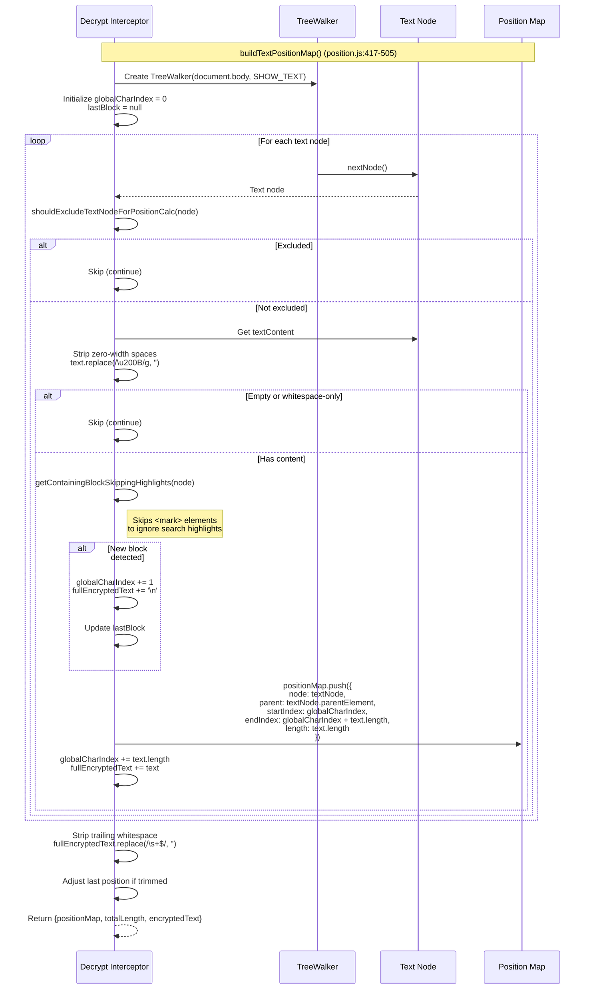
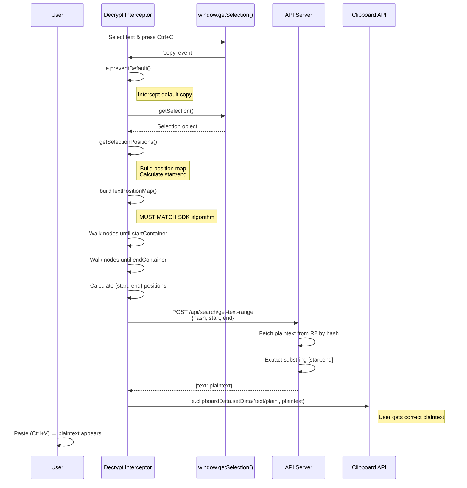
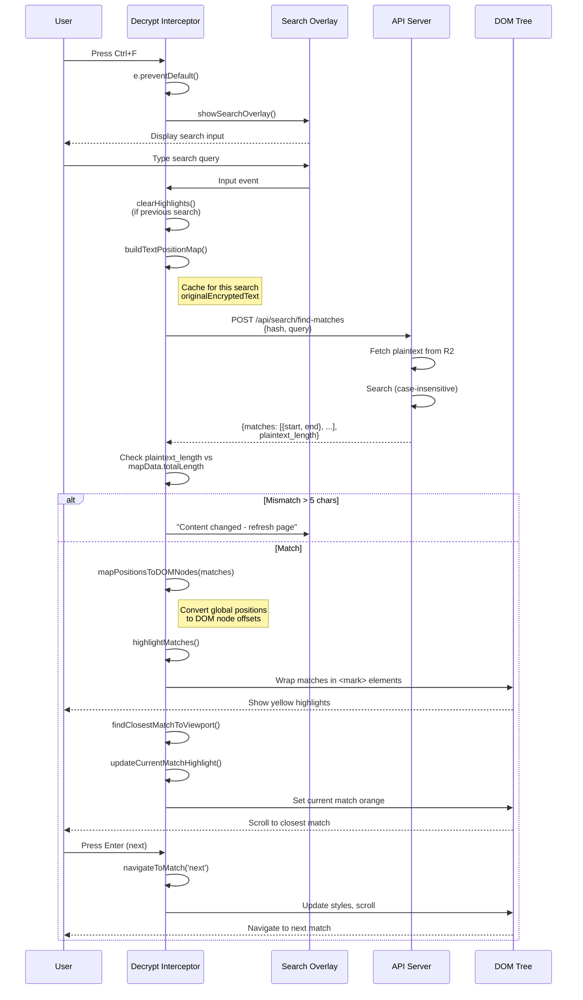

# Decrypt-Interceptor Flow

## Overview

The decrypt-interceptor provides copy/paste and search functionality for encrypted text. It does NOT decrypt the visual rendering (that's handled by encrypted fonts). Instead, it intercepts user interactions and retrieves plaintext from the server using position-based lookups.

**Core principle:** Position mapping must match SDK's algorithm EXACTLY, or copy/paste/search will return wrong text.

**Key components:**
1. **Position map building:** Calculate character positions using same algorithm as SDK
2. **Copy/paste interception:** Map selection to positions, fetch plaintext from server
3. **Search interception:** Server-side plaintext search, map results to DOM for highlighting

**Why server-side plaintext:** Security and performance. Client never exposes plaintext except in clipboard. Server stores plaintext in R2, indexed by hash for fast retrieval.

## Position Map Building

**CRITICAL:** This algorithm MUST match SDK's position tracking in `encryptTextNode()` and `uploadPlaintextToServer()` exactly.

### Purpose

Build a character-by-character map of encrypted text positions to DOM nodes. Used for:
- **Copy/paste:** Selection boundaries → character positions → server API → plaintext
- **Search:** Server returns character positions → DOM nodes → highlight locations

### Algorithm Diagram



### Implementation (position.js:417-505)

```javascript
function buildTextPositionMap() {
    const positionMap = [];
    let globalCharIndex = 0;
    let fullEncryptedText = '';
    let lastBlock = null;

    // Walk ALL text nodes in document order (same order as SDK)
    const walker = document.createTreeWalker(
        document.body,
        NodeFilter.SHOW_TEXT,
        null  // Accept all, we filter manually to match server exactly
    );

    let textNode;
    while (textNode = walker.nextNode()) {
        // Skip if this text node should be excluded
        // IMPORTANT: Use shouldExcludeTextNodeForPositionCalc to match getSelectionPositions
        if (shouldExcludeTextNodeForPositionCalc(textNode)) {
            continue;
        }

        // Get raw text content (server uses get_text which gives textContent equivalent)
        let text = textNode.textContent;

        // Remove zero-width spaces (matches server: .replace('\u200B', ''))
        text = text.replace(/\u200B/g, '');

        // Skip empty or whitespace-only text nodes (MUST MATCH SDK: !originalText.trim())
        if (text.length === 0 || !text.trim()) {
            continue;
        }

        // Check for block boundary - add 1 for \n marker
        // IMPORTANT: Use getContainingBlockSkippingHighlights to match getSelectionPositions
        const currentBlock = getContainingBlockSkippingHighlights(textNode);

        // Only add newline if both blocks are valid and different
        if (lastBlock !== null && currentBlock !== null && currentBlock !== lastBlock) {
            globalCharIndex += 1;  // Count the \n marker between blocks
            fullEncryptedText += '\n';
        }
        if (currentBlock !== null) {
            lastBlock = currentBlock;
        }

        // Add to position map
        positionMap.push({
            node: textNode,
            parent: textNode.parentElement,
            startIndex: globalCharIndex,
            endIndex: globalCharIndex + text.length,
            length: text.length
        });

        globalCharIndex += text.length;
        fullEncryptedText += text;
    }

    // Strip trailing whitespace to match server: .rstrip()
    const originalLength = fullEncryptedText.length;
    fullEncryptedText = fullEncryptedText.replace(/\s+$/, '');
    const trimmedChars = originalLength - fullEncryptedText.length;

    // Adjust the last position map entry if we trimmed characters
    if (trimmedChars > 0 && positionMap.length > 0) {
        const lastEntry = positionMap[positionMap.length - 1];
        lastEntry.endIndex -= trimmedChars;
        lastEntry.length -= trimmedChars;
        if (lastEntry.length <= 0) {
            positionMap.pop();
        }
    }

    return {
        positionMap: positionMap,
        totalLength: fullEncryptedText.length,
        encryptedText: fullEncryptedText
    };
}
```

### Critical Matching Requirements

**Must match SDK (cloak-sdk.js) exactly:**

| Aspect | SDK | DI | Match? |
|--------|-----|----|----|
| TreeWalker setup | `TreeWalker(element, SHOW_TEXT, acceptNode)` | `TreeWalker(document.body, SHOW_TEXT, null)` | ✅ Both walk text nodes |
| Exclusion function | `shouldExcludeNode(node)` | `shouldExcludeTextNodeForPositionCalc(node)` | ⚠️ Names differ - MUST verify internals match |
| Zero-width strip | `text.replace(/\u200B/g, '')` | `text.replace(/\u200B/g, '')` | ✅ Identical |
| Empty check | `!cleanText.trim()` | `!text.trim()` | ✅ Identical logic |
| Block detection | `getContainingBlock(node)` | `getContainingBlockSkippingHighlights(node)` | ⚠️ DI skips `<mark>` - correct for search |
| Block boundary logic | `if (lastBlock !== null && currentBlock !== null && currentBlock !== lastBlock) { pos += 1; }` | Same | ✅ Identical |
| Position increment | `totalCharacters += text.length` | `globalCharIndex += text.length` | ✅ Same (different var names) |
| Trailing strip | `fullPlaintext.replace(/\s+$/, '')` | `fullEncryptedText.replace(/\s+$/, '')` | ✅ Identical |

### Exclusion Logic (position.js:225-283)

**MUST MATCH SDK's shouldExcludeNode():**

```javascript
function shouldExcludeTextNode(textNode) {
    let parent = textNode.parentElement;
    while (parent && parent !== document.body && parent !== document.documentElement) {
        const tagName = parent.tagName ? parent.tagName.toLowerCase() : '';

        // Exclude elements by tag name (matches SDK excludeSelectors)
        if (EXCLUDE_SELECTORS.includes(tagName)) {
            return true;
        }

        // Exclude elements with excluded attributes (matches SDK excludeAttributes)
        for (const attr of EXCLUDE_ATTRIBUTES) {
            if (parent.hasAttribute(attr)) {
                return true;
            }
        }

        // Exclude data-cloak-exclude elements (matches SDK)
        if (parent.hasAttribute('data-cloak-exclude')) {
            return true;
        }

        // Exclude data-nosnippet elements (server-side compatibility)
        if (parent.hasAttribute('data-nosnippet')) {
            return true;
        }

        // NOTE: We DO NOT exclude encrypted-search-highlight here anymore!
        // The server's plaintext includes ALL text, including text that's currently
        // highlighted by search. If we excluded highlighted text, position calculations
        // would be off by the total length of all highlighted text.
        // The <mark> elements are just visual wrappers - the underlying text is unchanged.

        // CRITICAL: Exclude the search overlay UI entirely (matches SDK)
        if (parent.id === 'encrypted-search-overlay') {
            return true;
        }

        // Check custom exclude selectors from config (if available)
        if (window.encryptionConfig?.excludeSelectors) {
            const customSelectors = window.encryptionConfig.excludeSelectors.filter(s =>
                s.includes('.') || s.includes('#') || s.includes('[')
            );
            for (const selector of customSelectors) {
                try {
                    if (parent.matches(selector)) return true;
                } catch (e) {
                    // Invalid selector, skip
                }
            }
        }

        parent = parent.parentElement;
    }
    return false;
}
```

**Constants (position.js:217-218):**
```javascript
const EXCLUDE_SELECTORS = ['script', 'style', 'noscript', 'meta', 'link', 'head', 'svg', 'path', 'code', 'pre', 'kbd', 'samp', 'var', 'textarea', 'input'];
const EXCLUDE_ATTRIBUTES = ['hidden', 'aria-hidden'];
```

### Block Detection (position.js:295-311)

**MUST MATCH SDK's BLOCK_ELEMENTS list:**

```javascript
const BLOCK_ELEMENTS_SEARCH = ['P', 'DIV', 'H1', 'H2', 'H3', 'H4', 'H5', 'H6',
                               'UL', 'OL', 'LI', 'BLOCKQUOTE', 'PRE', 'SECTION',
                               'ARTICLE', 'HEADER', 'FOOTER', 'NAV', 'ASIDE',
                               'TABLE', 'TR', 'TD', 'TH', 'THEAD', 'TBODY', 'TFOOT',
                               'DL', 'DT', 'DD', 'FORM', 'FIELDSET', 'LEGEND',
                               'ADDRESS', 'HR', 'FIGURE', 'FIGCAPTION', 'MAIN', 'BODY'];

function getContainingBlockForSearch(node) {
    let current = node.nodeType === Node.TEXT_NODE ? node.parentElement : node;
    while (current && !BLOCK_ELEMENTS_SEARCH.includes(current.tagName)) {
        current = current.parentElement;
    }
    return current;
}
```

**Verified:** BLOCK_ELEMENTS arrays match between SDK and DI (via grep).

### Search Highlight Handling (copy.js:795-809)

**Special variant for position calculations during search:**

```javascript
function getContainingBlockSkippingHighlights(node) {
    let current = node.nodeType === Node.TEXT_NODE ? node.parentElement : node;
    while (current && current !== document.body) {
        // Skip over <mark> elements - they're not structural blocks
        if (current.tagName === 'MARK' && current.classList.contains('encrypted-search-highlight')) {
            current = current.parentElement;
            continue;
        }
        if (BLOCK_ELEMENTS.includes(current.tagName)) {
            return current;
        }
        current = current.parentElement;
    }
    return null;
}
```

**Why this exists:** When search is active, text nodes are wrapped in `<mark>` elements. Block detection must skip these wrappers to find the true structural block (P, DIV, etc.).

**Usage:**
- Used in `buildTextPositionMap()` (position.js:460)
- Used in `getSelectionPositions()` (copy.js:560)
- NOT used in `shouldExcludeTextNode()` - highlights are NOT excluded from position map

## Copy/Paste Flow

### User Interaction Sequence



### getSelectionPositions() (copy.js:409-788)

**Purpose:** Convert browser selection (startContainer, endContainer, offsets) to global character positions.

**Algorithm:**
1. Get selection range from browser
2. Build position map (if not already cached)
3. Walk all text nodes in document order
4. Track globalPosition, incrementing for block boundaries and text length
5. When walker reaches startContainer: record startPos
6. When walker reaches endContainer: record endPos
7. Return `{start: startPos, end: endPos}`

**Critical handling:**
- **Zero-width spaces:** Adjust offsets to exclude them (lines 596-601, 651-657)
- **Search highlights:** Use `getContainingBlockSkippingHighlights()` to skip `<mark>` wrappers (line 560)
- **Element containers:** Handle edge case where endContainer is ELEMENT_NODE (selection at element boundary) (lines 424-428, 636-649)

**Key code (lines 530-698):**
```javascript
const walker = document.createTreeWalker(
    document.body,
    NodeFilter.SHOW_TEXT,
    null
);

let globalPosition = 0;
let lastBlock = null;
let startPos = null;
let endPos = null;
let textNode;
let foundStart = false;
let foundEnd = false;

while (textNode = walker.nextNode()) {
    // Use the special exclusion function that INCLUDES highlight text
    if (shouldExcludeTextNodeForPositionCalc(textNode)) {
        continue;
    }

    const text = textNode.textContent.replace(/\u200B/g, '');
    if (text.length === 0 || !text.trim()) {
        continue;
    }

    // Check for block boundary
    const currentBlock = getContainingBlockSkippingHighlights(textNode);
    if (lastBlock !== null && currentBlock !== null && currentBlock !== lastBlock) {
        globalPosition += 1;  // Count the \n marker
    }
    if (currentBlock !== null) {
        lastBlock = currentBlock;
    }

    // Check if this node contains the start of selection
    if (!foundStart) {
        if (textNode === startContainer) {
            // Adjust for zero-width spaces
            let adjustedOffset = 0;
            const rawText = textNode.textContent;
            for (let i = 0; i < startOffset && i < rawText.length; i++) {
                if (rawText[i] !== '\u200B') {
                    adjustedOffset++;
                }
            }
            startPos = globalPosition + Math.min(adjustedOffset, text.length);
            foundStart = true;
        }
    }

    // Check if this node contains the end of selection
    if (textNode === endContainer) {
        if (endOffset === 0) {
            // Selection ends BEFORE this node
            foundEnd = true;
            break;
        } else {
            let adjustedOffset = 0;
            const rawText = textNode.textContent;
            for (let i = 0; i < endOffset && i < rawText.length; i++) {
                if (rawText[i] !== '\u200B') {
                    adjustedOffset++;
                }
            }
            endPos = globalPosition + Math.min(adjustedOffset, text.length);
            foundEnd = true;
        }
    } else if (foundStart && !foundEnd) {
        // After finding start, keep extending endPos
        endPos = globalPosition + text.length;
    }

    globalPosition += text.length;
}

return { start: startPos, end: endPos };
```

### API Call (copy.js:103-111)

```javascript
const xhr = new XMLHttpRequest();
const apiUrl = `${encryptionConfig.apiBaseUrl}/api/search/get-text-range`;
xhr.open('POST', apiUrl, false);  // Synchronous! Required by clipboardData API
setXhrHeaders(xhr);
xhr.send(JSON.stringify({
    start: positions.start,
    end: positions.end,
    hash: encryptionConfig.hash
}));

if (xhr.status === 200) {
    const data = JSON.parse(xhr.responseText);
    if (data.text) {
        finalText = data.text;
    }
}
```

**Why synchronous:** The `clipboardData` API requires immediate data during the `copy` event handler. Async would lose access to `e.clipboardData`.

### Clipboard Write (copy.js:286)

```javascript
e.clipboardData.setData('text/plain', finalText);
```

User gets plaintext when they paste (Ctrl+V).

## Search Flow

### User Interaction Sequence



### Search Interception (search.js:1348-1363)

```javascript
function setupSearchInterception() {
    console.log('%c🔍 Setting up Ctrl+F search interception...', 'color: #2196F3; font-weight: bold;');
    document.addEventListener('keydown', function(e) {
        if ((e.ctrlKey || e.metaKey) && e.key === 'f') {
            console.log('%c🔍 Ctrl+F detected! Intercepting...', 'color: #4CAF50; font-weight: bold;');
            e.preventDefault();
            e.stopPropagation();
            showSearchOverlay();
        }
    }, true);
}
```

**Result:** Browser's default search (showing encrypted text) is prevented, custom search overlay shown.

### Search Input Handler (search.js:1063-1237)

**Key optimizations:**
1. **AbortController:** Cancel in-flight searches when user types (lines 1067-1070)
2. **Position map caching:** Build once per search, reuse for all matches (lines 1101-1105)
3. **DOM change detection:** Compare server's plaintext_length with client's (lines 1149-1176)

**Algorithm (simplified):**
```javascript
async function handleSearchInput(event) {
    const query = event.target.value;

    // Cancel previous search
    if (searchState.abortController) {
        searchState.abortController.abort();
    }

    // Handle empty query
    if (!query || query.trim().length === 0) {
        clearHighlights();
        return;
    }

    // Cache original encrypted text on first search
    if (!searchState.originalEncryptedText) {
        clearHighlights();
        const mapData = buildTextPositionMap();
        searchState.originalEncryptedText = mapData.encryptedText;
    }

    // Server-side search
    const serverResult = await searchServerSide(query, signal);

    // Check for DOM changes
    if (serverResult.plaintext_length !== undefined) {
        const lengthDiff = Math.abs(mapData.totalLength - serverResult.plaintext_length);
        if (lengthDiff > 5) {
            searchState.matchCounter.textContent = 'Content changed - refresh page';
            searchState.matchCounter.style.color = '#ff6b6b';
            return;
        }
    }

    // Build fresh position map (with clean DOM)
    clearHighlights();
    const mapData = buildTextPositionMap();

    // Map server positions to DOM
    const domMatches = mapPositionsToDOMNodes(serverResult.matches, mapData.positionMap);

    // Highlight
    if (domMatches.length > 0) {
        highlightMatches(domMatches, -1);  // -1 = don't auto-scroll yet
        const closestIndex = findClosestMatchToViewport();
        updateCurrentMatchHighlight(closestIndex);
    }

    updateMatchCounter();
}
```

### Server Search (search.js:1-41)

```javascript
async function searchServerSide(query, signal) {
    try {
        const response = await fetch(`${encryptionConfig.apiBaseUrl}/api/search/find-matches`, {
            method: 'POST',
            headers: getApiHeaders(),
            signal: signal,  // Pass abort signal for cancellation
            body: JSON.stringify({
                query: query,
                hash: encryptionConfig.hash
            })
        });

        if (!response.ok) {
            console.error('Server search failed:', response.status);
            return { matches: [] };
        }

        const data = await response.json();
        return {
            matches: data.matches || [],
            plaintext_length: data.plaintext_length  // For DOM change detection
        };
    } catch (error) {
        if (error.name === 'AbortError') {
            return { matches: [], aborted: true };
        }
        return { matches: [] };
    }
}
```

**Server response:**
```json
{
  "matches": [
    {"start": 42, "end": 47},
    {"start": 103, "end": 108}
  ],
  "plaintext_length": 3199
}
```

### Map Positions to DOM (position.js:43-114)

**Purpose:** Convert server's global character positions to DOM node-relative offsets.

**Input:**
- `matches`: Array of `{start, end}` from server (global positions)
- `positionMap`: Array of `{node, startIndex, endIndex}` from buildTextPositionMap()

**Output:**
- `domMatches`: Array of `{node, parent, startIndex, endIndex, text}` ready for highlighting

**Algorithm:**
```javascript
function mapPositionsToDOMNodes(matches, positionMap) {
    const domMatches = [];

    for (const match of matches) {
        const matchStart = match.start;
        const matchEnd = match.end;

        // Find ALL text nodes that overlap with this match
        const overlappingNodes = [];

        for (const nodeInfo of positionMap) {
            const nodeStart = nodeInfo.startIndex;
            const nodeEnd = nodeInfo.endIndex;

            // Check if this node overlaps with the match
            if (matchStart < nodeEnd && matchEnd > nodeStart) {
                overlappingNodes.push(nodeInfo);
            }
        }

        if (overlappingNodes.length === 0) {
            console.warn('Could not find any nodes for match:', match);
            continue;
        }

        // Single-node match (most common)
        if (overlappingNodes.length === 1) {
            const nodeInfo = overlappingNodes[0];
            const nodeStart = nodeInfo.startIndex;

            // Convert global positions to node-relative positions
            const nodeRelativeStart = matchStart - nodeStart;
            const nodeRelativeEnd = matchEnd - nodeStart;

            domMatches.push({
                node: nodeInfo.node,
                parent: nodeInfo.parent,
                startIndex: nodeRelativeStart,
                endIndex: nodeRelativeEnd,
                text: nodeInfo.node.textContent.substring(nodeRelativeStart, nodeRelativeEnd)
            });
        } else {
            // Multi-node match (spans multiple text nodes)
            const firstNode = overlappingNodes[0];
            domMatches.push({
                node: firstNode.node,
                parent: firstNode.parent,
                startIndex: matchStart - firstNode.startIndex,
                endIndex: matchEnd - firstNode.startIndex,
                text: '',
                overlappingNodes: overlappingNodes  // For multi-node highlighting
            });
        }
    }

    return domMatches;
}
```

### Highlight Matches (search.js:901-987)

**Purpose:** Wrap matched text in `<mark class="encrypted-search-highlight">` elements.

**Key challenges:**
1. **Text node splitting:** Must split text nodes into before/match/after parts
2. **Multi-node matches:** Matches may span multiple text nodes (e.g., across `<span>` boundaries)
3. **Prevent re-encryption:** New text nodes must be marked `._cloakEncrypted = true`
4. **Preserve DOM structure:** Group matches by node to process all matches in a node at once

**Algorithm (simplified):**
```javascript
function highlightMatches(matches, currentIndex, isNavigation = false) {
    // For navigation, just update styling
    if (isNavigation) {
        updateCurrentMatchHighlight(currentIndex);
        return;
    }

    // Full rebuild for new searches
    clearHighlights();
    if (matches.length === 0) return;

    // Group matches by text node
    const matchesByNode = new Map();
    for (const match of matches) {
        if (!matchesByNode.has(match.node)) {
            matchesByNode.set(match.node, []);
        }
        matchesByNode.get(match.node).push(match);
    }

    // Process each node's matches (reverse order to preserve offsets)
    for (const node of matchesByNode.keys()) {
        const nodeMatches = matchesByNode.get(node);
        nodeMatches.sort((a, b) => a.startIndex - b.startIndex);
        highlightMultipleMatchesInNode(node, nodeMatches, currentIndex);
    }

    // Update scroll bar markers
    updateScrollMarkers(currentIndex);
}
```

**Highlighting a single node with multiple matches:**
```javascript
function highlightMultipleMatchesInNode(textNode, matches, currentMatchIndex) {
    const rawText = textNode.textContent;
    const parent = textNode.parentNode;
    const fragment = document.createDocumentFragment();
    let lastEnd = 0;

    for (const match of matches) {
        // Add text before this match
        if (match.startIndex > lastEnd) {
            const newTextNode = document.createTextNode(rawText.substring(lastEnd, match.startIndex));
            newTextNode._cloakEncrypted = true;  // CRITICAL: Prevent re-encryption
            fragment.appendChild(newTextNode);
        }

        // Add the highlight
        const highlight = document.createElement('mark');
        highlight.className = 'encrypted-search-highlight';
        highlight.style.backgroundColor = match.matchIndex === currentMatchIndex ? '#ff9632' : 'yellow';
        highlight.style.fontFamily = 'inherit';  // CRITICAL: Keep encrypted font
        highlight.textContent = rawText.substring(match.startIndex, match.endIndex);
        highlight.setAttribute('data-match-index', match.matchIndex);

        fragment.appendChild(highlight);
        searchState.allHighlightMarks.push(highlight);
        lastEnd = match.endIndex;
    }

    // Add remaining text
    if (lastEnd < rawText.length) {
        const newTextNode = document.createTextNode(rawText.substring(lastEnd));
        newTextNode._cloakEncrypted = true;  // CRITICAL: Prevent re-encryption
        fragment.appendChild(newTextNode);
    }

    // Replace original text node with fragment
    parent.replaceChild(fragment, textNode);
}
```

**CRITICAL:** New text nodes marked `._cloakEncrypted = true` to prevent SDK's MutationObserver from re-encrypting them (they already contain encrypted text).

### Navigate Matches (search.js:989-1003)

```javascript
function navigateToMatch(direction) {
    const matches = searchState.currentMatches;
    if (matches.length === 0) return;

    if (direction === 'next') {
        searchState.currentMatchIndex = (searchState.currentMatchIndex + 1) % matches.length;
    } else if (direction === 'prev') {
        searchState.currentMatchIndex = searchState.currentMatchIndex <= 0
            ? matches.length - 1
            : searchState.currentMatchIndex - 1;
    }

    highlightMatches(matches, searchState.currentMatchIndex, true);  // true = navigation mode
    updateMatchCounter();
}
```

**Performance optimization:** Navigation mode (`isNavigation = true`) only updates highlight colors and scroll position without rebuilding DOM. Much faster than clearing and re-highlighting.

## Critical Matching Requirements

**These must match SDK exactly:**

### 1. shouldExcludeTextNodeForPositionCalc vs shouldExcludeNode
⚠️ **VERIFY:** Function names differ, internals MUST match

**SDK checks (cloak-sdk.js:136-242):**
- Tag names in excludeSelectors
- Attributes in excludeAttributes
- data-cloak-exclude attribute
- data-nosnippet attribute
- encrypted-search-highlight class
- encrypted-search-overlay ID
- Custom selectors from config

**DI checks (position.js:225-283, copy.js:346-399):**
- Same list (verified)
- ⚠️ **CRITICAL:** DI has two variants:
  - `shouldExcludeTextNode()`: Used for general exclusion
  - `shouldExcludeTextNodeForPositionCalc()`: Used for position mapping, INCLUDES text inside `<mark>` highlights

### 2. Block Detection
✅ **VERIFIED:** BLOCK_ELEMENTS arrays match via grep

**SDK:** `BLOCK_ELEMENTS` (cloak-sdk.js:245-250)
**DI:** `BLOCK_ELEMENTS_SEARCH` (position.js:295-300)

**DI special case:** `getContainingBlockSkippingHighlights()` skips `<mark>` wrappers when searching for structural block

### 3. Text-Transform Handling
⚠️ **NEEDS VERIFICATION:**
- SDK applies text-transform BEFORE encryption (cloak-sdk.js:361-378)
- SDK uses TRANSFORMED text length for positions (line 387)
- Does DI detect and apply text-transform?
- **If not, positions will mismatch on elements with CSS text-transform**

## Known Issues and Mitigations

### 1. Search Highlights Splitting Text Nodes

**Problem:** When search highlights are applied, text nodes are split into before/match/after parts wrapped in `<mark>` elements. This changes DOM structure.

**Mitigation:**
- `getContainingBlockSkippingHighlights()` skips `<mark>` when finding structural blocks
- `shouldExcludeTextNodeForPositionCalc()` INCLUDES text inside `<mark>` (they're just wrappers)
- New text nodes marked `._cloakEncrypted = true` to prevent re-encryption

### 2. DOM Changes After Plaintext Upload

**Problem:** If page content changes (e.g., user posts comment), server has old plaintext, new content not searchable.

**Detection:** Compare `mapData.totalLength` (current DOM) with `serverResult.plaintext_length` (server's version)

**Mitigation:**
- If difference > 5 chars: show warning "Content changed - refresh page"
- SDK re-uploads plaintext after mutations, but brief window exists

### 3. Position Calculation with Active Highlights

**Problem:** When user copies text during active search, position calculation must handle split text nodes.

**Solution:**
- Build position map from CURRENT DOM state (includes `<mark>` elements)
- Skip `<mark>` wrappers when detecting blocks
- Include text inside `<mark>` in position counts
- This way, positions still match server's plaintext (which has no highlights)

### 4. Synchronous XHR for Copy/Paste

**Problem:** `clipboardData` API requires immediate data in copy event handler.

**Solution:** Use synchronous XHR (`xhr.open('POST', url, false)`)
- Not ideal (blocks UI thread)
- But necessary for copy/paste to work
- Alternative would be custom clipboard handling (more complex)

## Summary

**Decrypt-interceptor responsibilities:**
1. Build position map using SAME algorithm as SDK
2. Intercept copy/paste: map selection to positions, fetch plaintext from server
3. Intercept search: server-side search, map results to DOM, highlight matches

**Critical for correctness:**
- Position mapping MUST match SDK exactly (TreeWalker, exclusions, block boundaries, zero-width handling)
- Text-transform handling MUST be consistent with SDK
- Search highlight handling MUST skip `<mark>` wrappers for block detection
- New text nodes MUST be marked `._cloakEncrypted` to prevent re-encryption

**For SDK encryption details:** See [encryption-flow.md](./encryption-flow.md)
