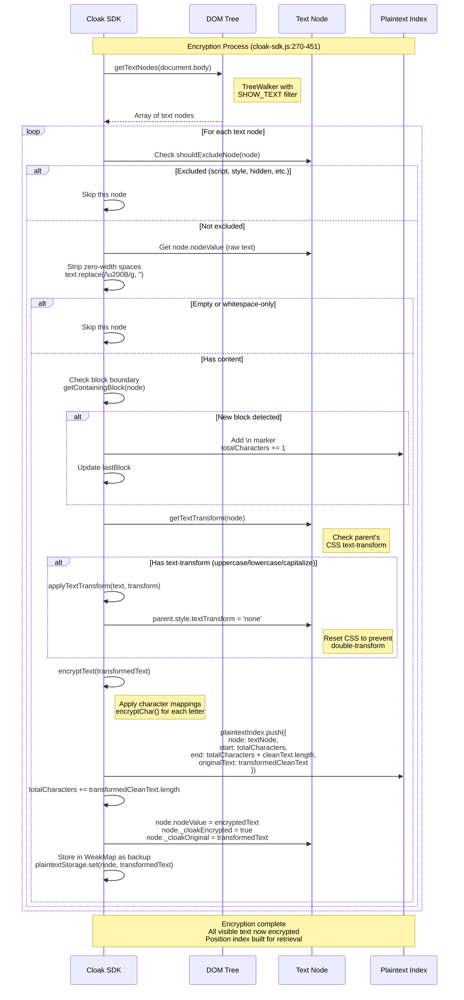

# SDK Encryption Flow

## Encryption Overview

The Cloak SDK encrypts text on the client side using a **Feistel cipher** with character mappings provided by the server. Encrypted text is rendered using custom encrypted fonts that visually decrypt the content for human readers.

**Core approach:**
- **Character-level encryption:** Each letter mapped to a different letter (A→F, B→Q, etc.)
- **Whitespace preservation:** Spaces, tabs, newlines NOT encrypted - browser's text rendering works normally
- **Position tracking:** Build a 1:1 character index mapping DOM positions to plaintext for copy/paste/search
- **Font-based visual decryption:** Encrypted fonts have swapped glyphs so encrypted text displays correctly

**Why Feistel cipher:** Provides reversible character-level encryption with a flat mapping table (no complex state). Server generates mappings, client applies them.

**Critical requirement:** Position tracking must match decrypt-interceptor's algorithm EXACTLY, or copy/paste/search will return wrong text.

## Encryption Sequence Diagram



## Position Tracking Algorithm

**Purpose:** Build a character-by-character index mapping plaintext positions to DOM text nodes, enabling server-side plaintext retrieval for copy/paste/search.

**Critical principle:** This algorithm MUST match decrypt-interceptor's `buildTextPositionMap()` exactly. Any difference causes position mismatches.

### Algorithm Steps

**From `encryptTextNode()` (cloak-sdk.js:332-411):**

1. **Get raw text:** `textNode.nodeValue` (line 336)
2. **Strip zero-width spaces:** `text.replace(/\u200B/g, '')` → `cleanText` (line 340)
3. **Skip empty nodes:** `if (cleanText.length === 0 || !cleanText.trim()) return;` (line 344)
4. **Check block boundary:**
   - Get containing block: `getContainingBlock(textNode)` (line 347)
   - If new block: `totalCharacters += 1` for `\n` marker (line 351)
   - Update tracking: `lastBlock = currentBlock` (line 354)
5. **Apply text-transform (CRITICAL):**
   - Get transform: `getTextTransform(textNode)` → 'uppercase'|'lowercase'|'capitalize'|'none' (line 361)
   - If not 'none': transform text BEFORE encryption (line 366)
   - Reset parent CSS: `parent.style.textTransform = 'none'` (line 371)
   - **Position tracking uses TRANSFORMED text length** (line 387)
6. **Encrypt:** `encryptText(transformedText)` (line 381)
7. **Track position:**
   ```javascript
   const startPos = totalCharacters;
   totalCharacters += transformedCleanText.length;
   plaintextIndex.push({
       node: textNode,
       start: startPos,
       end: totalCharacters,
       originalText: transformedCleanText  // Transformed version!
   });
   ```
   (lines 386-395)
8. **Update DOM:** `textNode.nodeValue = encryptedText` (line 401)
9. **Mark encrypted:** `textNode._cloakEncrypted = true` (line 402)
10. **Store plaintext:** `textNode._cloakOriginal = transformedText` + WeakMap backup (lines 403-407)

### Position Index Structure

```javascript
plaintextIndex = [
    {
        node: <TextNode>,           // Reference to DOM text node
        start: 0,                   // Global character position (start)
        end: 12,                    // Global character position (end)
        originalText: "Hello world", // Plaintext (after text-transform applied)
        hasBlockBoundaryBefore: false
    },
    // \n marker here (position 12, counted but not stored)
    {
        node: <TextNode>,
        start: 13,                  // 12 + 1 for \n
        end: 28,
        originalText: "Next paragraph",
        hasBlockBoundaryBefore: true
    },
    // ...
]
```

**Global position counter:** `totalCharacters` increments by:
- `+1` for each block boundary (newline marker)
- `+text.length` for each text node's content (after zero-width strip, after text-transform)

### Block Boundary Detection

**MUST MATCH decrypt-interceptor logic exactly.**

**Block elements list (lines 245-250):**
```javascript
const BLOCK_ELEMENTS = ['P', 'DIV', 'H1', 'H2', 'H3', 'H4', 'H5', 'H6',
                        'LI', 'OL', 'UL', 'BLOCKQUOTE', 'PRE', 'SECTION',
                        'ARTICLE', 'HEADER', 'FOOTER', 'NAV', 'ASIDE',
                        'TABLE', 'TR', 'TD', 'TH', 'THEAD', 'TBODY', 'TFOOT',
                        'DL', 'DT', 'DD', 'FORM', 'FIELDSET', 'LEGEND',
                        'ADDRESS', 'HR', 'FIGURE', 'FIGCAPTION', 'MAIN', 'BODY'];
```

**Function (lines 256-262):**
```javascript
function getContainingBlock(node) {
    let current = node.nodeType === Node.TEXT_NODE ? node.parentElement : node;
    while (current && !BLOCK_ELEMENTS.includes(current.tagName)) {
        current = current.parentElement;
    }
    return current;
}
```

**Usage (lines 347-355):**
```javascript
const currentBlock = getContainingBlock(textNode);
if (lastBlock !== null && currentBlock !== null && currentBlock !== lastBlock) {
    totalCharacters += 1;  // Count the \n marker between blocks
}
if (currentBlock !== null) {
    lastBlock = currentBlock;
}
```

**Why this matters:**
- Newline markers preserve paragraph structure in plaintext index
- Server searches plaintext, returns positions including newline markers
- Decrypt-interceptor must count newlines identically to map server positions to DOM

## Text-Transform Handling

**CRITICAL edge case:** CSS `text-transform` changes displayed text without changing DOM content.

**Example problem:**
```html
<p style="text-transform: uppercase">hello world</p>
```
- DOM contains: "hello world" (12 chars)
- Browser displays: "HELLO WORLD" (12 chars, but different letters)
- If we encrypt "hello world" but user sees "HELLO WORLD", they'll see gibberish

**Solution:** Transform text BEFORE encryption, reset CSS to prevent double-transform.

### Detection (lines 301-306)

```javascript
function getTextTransform(textNode) {
    const parent = textNode.parentElement;
    if (!parent) return 'none';
    const style = window.getComputedStyle(parent);
    return style.textTransform || 'none';
}
```

### Application (lines 312-324)

```javascript
function applyTextTransform(text, transform) {
    switch (transform) {
        case 'uppercase':
            return text.toUpperCase();
        case 'lowercase':
            return text.toLowerCase();
        case 'capitalize':
            // Capitalize first letter of each word
            return text.replace(/\b\w/g, char => char.toUpperCase());
        default:
            return text;
    }
}
```

### Encryption with Transform (lines 361-378)

```javascript
const textTransform = getTextTransform(textNode);
let textToEncrypt = originalText;

if (textTransform !== 'none') {
    // Apply the transform to get the displayed text
    textToEncrypt = applyTextTransform(originalText, textTransform);

    // Mark parent element to reset text-transform after encryption
    const parent = textNode.parentElement;
    if (parent && !parent._cloakTextTransformReset) {
        parent.style.textTransform = 'none';
        parent._cloakTextTransformReset = true;

        if (config.debug) {
            console.log(`[Cloak] Reset text-transform on parent: ${parent.tagName}.${parent.className} (was: ${textTransform})`);
        }
    }
}

// Encrypt the transformed text
const encryptedText = encryptText(textToEncrypt);
```

### Position Tracking with Transform (lines 384-393)

```javascript
// Track for plaintext index - use the TRANSFORMED text for position tracking
// since that's what the user sees and will select/copy
const transformedCleanText = applyTextTransform(cleanText, textTransform);
const startPos = totalCharacters;
totalCharacters += transformedCleanText.length;  // Use transformed length!

plaintextIndex.push({
    node: textNode,
    start: startPos,
    end: totalCharacters,
    originalText: transformedCleanText,  // Store transformed clean text
    hasBlockBoundaryBefore: lastBlock !== null && currentBlock !== lastBlock
});
```

**Why position tracking uses transformed length:**
- User sees and selects the TRANSFORMED text
- If original is "hello" (5 chars) but displayed as "HELLO" (5 chars), positions match
- But if transform changes length (rare edge case: locale-specific transforms), positions must use displayed length

**MUST MATCH requirement:**
- Decrypt-interceptor MUST also detect text-transform and use transformed length
- Otherwise positions will mismatch on elements with text-transform CSS

## Code Walkthrough

### Main Encryption Entry Point

**Location:** `cloak-sdk.js:1810-1812` (within `init()`)

```javascript
// Encrypt existing content
const existingNodes = getTextNodes(document.body);
existingNodes.forEach(encryptTextNode);
```

### getTextNodes() - Tree Traversal (lines 270-295)

```javascript
function getTextNodes(element) {
    const textNodes = [];
    const walker = document.createTreeWalker(
        element,
        NodeFilter.SHOW_TEXT,
        {
            acceptNode: (node) => {
                const excluded = shouldExcludeNode(node);
                if (excluded) {
                    return NodeFilter.FILTER_REJECT;
                }
                // Strip zero-width spaces FIRST, then check trim
                // MUST MATCH decrypt-interceptor logic
                const text = node.textContent.replace(/\u200B/g, '');
                if (text.length === 0 || !text.trim()) return NodeFilter.FILTER_REJECT;
                return NodeFilter.FILTER_ACCEPT;
            }
        }
    );

    let node;
    while (node = walker.nextNode()) {
        textNodes.push(node);
    }
    return textNodes;
}
```

**Key points:**
- TreeWalker visits text nodes in document order (depth-first)
- `SHOW_TEXT` filter means only text nodes, not elements
- `acceptNode` callback filters out excluded/empty nodes
- Returns array of text nodes ready for encryption

### shouldExcludeNode() - Exclusion Logic (lines 136-242)

**For text nodes:**
```javascript
if (node.nodeType === Node.TEXT_NODE) {
    let element = node.parentElement;
    while (element) {
        // Check tag name
        const tagName = element.tagName.toLowerCase();
        if (config.excludeSelectors.includes(tagName)) return true;

        // Check excluded attributes
        for (const attr of config.excludeAttributes) {
            if (element.hasAttribute(attr)) return true;
        }

        // Check for data-cloak-exclude attribute
        if (element.hasAttribute('data-cloak-exclude')) {
            return true;
        }

        // Check for data-nosnippet attribute (MUST MATCH decrypt-interceptor.js)
        if (element.hasAttribute('data-nosnippet')) return true;

        // CRITICAL: Exclude search highlight elements to prevent double-encryption
        if (element.classList && element.classList.contains('encrypted-search-highlight')) return true;

        // CRITICAL: Exclude the search overlay UI entirely
        if (element.id === 'encrypted-search-overlay') return true;

        // Check if element matches any custom exclude selector from config
        const customSelectors = config.excludeSelectors.filter(s =>
            s.includes('.') || s.includes('#') || s.includes('[')
        );
        for (const selector of customSelectors) {
            try {
                if (element.matches(selector)) return true;
            } catch (e) {
                // Invalid selector, skip
            }
        }

        element = element.parentElement;
    }
    return false;
}
```

**Default exclusions (lines 67-71):**
```javascript
const DEFAULT_CONFIG = {
    excludeSelectors: ['script', 'style', 'noscript', 'meta', 'link', 'head'],
    excludeAttributes: ['hidden', 'aria-hidden'],
    // ...
};
```

**MUST MATCH decrypt-interceptor:**
- Same tag names excluded
- Same attributes checked
- Same data-cloak-exclude handling
- Same data-nosnippet handling
- Same search highlight exclusion

### encryptChar() - Character Encryption (lines 101-119)

```javascript
function encryptChar(char) {
    if (!characterMappings) return char;

    // CRITICAL: Do NOT encrypt ANY whitespace (space, tab, newline, etc.)
    // The browser's whitespace handling must work normally:
    // - Multiple spaces collapse to one
    // - Newlines become spaces (in normal flow)
    // - Line wrapping works at word boundaries
    // If we encrypt spaces to visible characters, all this breaks.
    // The space character in the font is NOT swapped, so regular spaces render correctly.
    if (/\s/.test(char)) {
        return char;
    }

    // Use the flat mapping from server for letters
    if (characterMappings[char]) return characterMappings[char];

    return char; // Numbers, punctuation, etc. pass through
}
```

**Key insight:** Only encrypt letters, leave whitespace/punctuation unchanged. This preserves:
- Word wrapping
- Whitespace collapsing
- Line breaking
- Text selection behavior

**Character mappings structure (from server):**
```javascript
characterMappings = {
    'A': 'F',
    'B': 'Q',
    'C': 'W',
    // ... all uppercase letters
    'a': 'x',
    'b': 'k',
    'c': 'j',
    // ... all lowercase letters
}
```

### encryptText() - String Encryption (lines 124-127)

```javascript
function encryptText(text) {
    if (!characterMappings) return text;
    return text.split('').map(encryptChar).join('');
}
```

Simple character-by-character application of `encryptChar()`.

### encryptTextNode() - Full Algorithm (lines 332-411)

See [Position Tracking Algorithm](#position-tracking-algorithm) section above for full breakdown.

**Key steps:**
1. Get nodeValue (raw text)
2. Strip zero-width spaces
3. Skip if empty/whitespace-only
4. Check block boundary (add \n marker if new block)
5. Detect and apply text-transform
6. Encrypt transformed text
7. Track position in plaintextIndex
8. Update DOM with encrypted text
9. Mark node as encrypted
10. Store plaintext in _cloakOriginal and WeakMap

### Plaintext Upload Algorithm (lines 1559-1705)

**Purpose:** Rebuild full plaintext from DOM and upload to server for search/copy functionality.

**CRITICAL:** Uses SAME algorithm as encryptTextNode() - must produce identical positions.

**From `uploadPlaintextToServer()` (lines 1574-1649):**

```javascript
// Build plaintext by walking ALL text nodes in document order
// This MUST match decrypt-interceptor.js buildTextPositionMap() exactly
let fullPlaintext = '';
let lastBlock = null;

// Use TreeWalker to iterate in exact document order (same as decrypt-interceptor)
const walker = document.createTreeWalker(
    document.body,
    NodeFilter.SHOW_TEXT,
    null  // Accept all, filter manually to match decrypt-interceptor exactly
);

let textNode;
while (textNode = walker.nextNode()) {
    // Skip excluded nodes (matches decrypt-interceptor shouldExcludeTextNode)
    if (shouldExcludeNode(textNode)) {
        continue;
    }

    // Get raw text content
    let text = textNode.textContent;

    // Remove zero-width spaces (matches decrypt-interceptor)
    text = text.replace(/\u200B/g, '');

    // Skip empty or whitespace-only text nodes (matches decrypt-interceptor)
    if (text.length === 0 || !text.trim()) {
        continue;
    }

    // Check for block boundary - add \n marker (matches decrypt-interceptor)
    const currentBlock = getContainingBlock(textNode);
    if (lastBlock !== null && currentBlock !== null && currentBlock !== lastBlock) {
        fullPlaintext += '\n'; // Block boundary marker
    }
    if (currentBlock !== null) {
        lastBlock = currentBlock;
    }

    // Get original (unencrypted) text for this node
    let originalText;
    if (textNode._cloakEncrypted && textNode._cloakOriginal) {
        originalText = textNode._cloakOriginal;
    } else if (textNode._cloakEncrypted && plaintextStorage.has(textNode)) {
        originalText = plaintextStorage.get(textNode);
    } else if (textNode._cloakEncrypted) {
        // Skip - this happens when highlights split nodes
        continue;
    } else {
        originalText = text;  // Not encrypted - use current text
    }

    // Strip zero-width spaces from original
    originalText = originalText.replace(/\u200B/g, '');

    fullPlaintext += originalText;
}

// Strip trailing whitespace (matches decrypt-interceptor: .rstrip())
fullPlaintext = fullPlaintext.replace(/\s+$/, '');
```

**Upload (lines 1674-1681):**
```javascript
const response = await fetch(`${config.apiBaseUrl}/api/sdk/upload-plaintext`, {
    method: 'POST',
    headers: {
        'Content-Type': 'application/json',
        'X-API-Key': encryptionConfig.apiKey
    },
    body: JSON.stringify({
        storageId: encryptionConfig.storageId,
        hash: encryptionConfig.hash,
        plaintext: fullPlaintext,
        sessionId: encryptionConfig.sessionId
    })
});
```

## Critical Matching Requirements

**These aspects MUST match decrypt-interceptor exactly:**

### 1. TreeWalker Configuration
✅ Both use `document.createTreeWalker(document.body, NodeFilter.SHOW_TEXT, null)`

### 2. Exclusion Logic
⚠️ **VERIFY:** `shouldExcludeNode()` in SDK vs `shouldExcludeTextNode()` in DI
- Must check same selectors
- Must check same attributes
- Must handle data-cloak-exclude identically
- Must handle search highlights identically

### 3. Zero-Width Space Stripping
✅ Both use `text.replace(/\u200B/g, '')` BEFORE length calculations

### 4. Empty Node Skipping
✅ Both use `if (text.length === 0 || !text.trim())`

### 5. Block Boundary Detection
✅ BLOCK_ELEMENTS arrays match (verified via grep)
✅ Block boundary logic identical: `if (lastBlock !== null && currentBlock !== null && currentBlock !== lastBlock)`

### 6. Position Increment
✅ Both increment by 1 for newline, by text.length for content

### 7. Trailing Whitespace Strip
✅ Both use `.replace(/\s+$/, '')` at end

### 8. Text-Transform Handling
⚠️ **CRITICAL VERIFICATION NEEDED:**
- SDK applies text-transform BEFORE encryption
- SDK uses TRANSFORMED text length for positions
- Does decrypt-interceptor also detect text-transform?
- Does decrypt-interceptor use transformed length?
- **If not, positions will mismatch on elements with CSS text-transform**

## Known Edge Cases

### 1. Zero-Width Spaces
- **Where they appear:** Inserted by some text editors, soft hyphens (\u200B), word joiners
- **Handling:** Stripped BEFORE all operations (encryption, length calculations)
- **Why:** They don't display, so shouldn't affect positions

### 2. Whitespace Collapsing
- **Browser behavior:** Multiple spaces collapse to one in normal flow
- **Handling:** Spaces NOT encrypted, so browser handles normally
- **Position tracking:** Counts actual spaces in DOM, not displayed spaces

### 3. Text-Transform
- **Problem:** CSS changes displayed text without changing DOM
- **Handling:** Detect via getComputedStyle, transform before encryption, reset CSS
- **Position tracking:** Uses transformed length
- **Risk:** If DI doesn't handle this, positions mismatch

### 4. Block Boundaries
- **Problem:** Need newlines between paragraphs for search/copy to work correctly
- **Handling:** Insert \n marker between block-level elements
- **Position tracking:** Increment by 1 for each \n
- **Risk:** If DI uses different BLOCK_ELEMENTS list, positions mismatch

### 5. Dynamic Content
- **Problem:** MutationObserver re-encrypts new content, need to rebuild plaintext
- **Handling:** `lastBlock` reset before each batch (line 428), plaintext re-uploaded
- **Risk:** Brief window where server has old plaintext

### 6. Search Highlights
- **Problem:** Search adds `<mark>` elements that split text nodes
- **Handling:** Excluded via `encrypted-search-highlight` class check
- **New nodes:** Marked `._cloakEncrypted = true` to prevent re-encryption
- **Risk:** If not excluded, would double-encrypt highlighted text

## Integration Points

### Called by init() (line 1810)
```javascript
// Reset block tracking for initial encryption
lastBlock = null;

// Encrypt existing content
const existingNodes = getTextNodes(document.body);
existingNodes.forEach(encryptTextNode);
```

### Called by MutationObserver (lines 486-496)
```javascript
for (const mutation of mutations) {
    if (mutation.type === 'childList') {
        for (const node of mutation.addedNodes) {
            if (shouldExcludeNode(node)) continue;
            if (node._cloakEncrypted) continue;  // Already encrypted
            queueNode(node);
        }
    }
}
```

Batched via `processPendingNodes()` (lines 416-451) with 16ms delay.

### Triggers Plaintext Upload
After encryption completes, `uploadPlaintextToServer()` is called (line 1823) to provide plaintext for search/copy.

## Summary

**Encryption flow:**
1. Walk all text nodes in document order
2. Exclude scripts/styles/hidden elements
3. Strip zero-width spaces
4. Detect block boundaries (insert \n markers)
5. Apply CSS text-transform if present
6. Encrypt letters (not whitespace/punctuation)
7. Track positions in plaintextIndex
8. Upload full plaintext to server

**Critical for correctness:**
- Position tracking must be identical to decrypt-interceptor
- Text-transform must be handled consistently
- Block boundaries must use same element list
- Exclusion logic must match exactly

**For detailed decrypt-interceptor algorithm:** See [decryption-flow.md](./decryption-flow.md)
